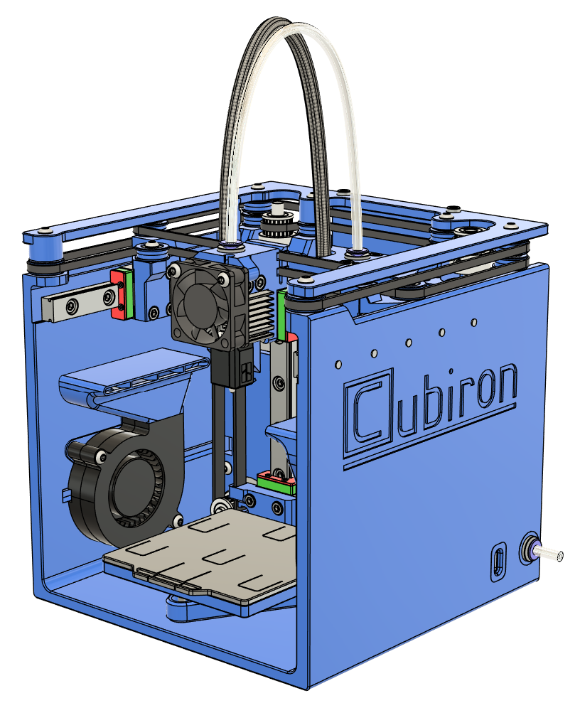

# 🧊 Cubiron — DIY Tiny FDM 3D Printer

Cubiron is a fully DIY, ultra-compact FDM 3D printer designed for low-cost, small-format printing, and hands-on learning. It's built entirely from open-source parts and the cheapest components available, using custom printable mechanics and Klipper firmware.

---
## ✏️ Editor's Notes
- 03/09/2025: Added files for 1st public release.

---

## 🔧 Features

- 🔲 **70x70x65mm** Print Volume
- 📏 **144x145x148mm** Printer Size
- 🚀 Up to **500mm/s** and **10k mm/s²**
- 💧 **~10mm³ Flow** with PLA
- 🏷️ **~$270** Hardware cost
- 🧰 **1.5kg or 3.3lbs** Weight
- 🔌 **USB-C 20V**
- 💡 All 3d printed parts from **PETG**
- 📐 Includes **CAD files, BOM, STLs, printer.cfg**, and **slicer profiles**

---

## 📦 Included in this Repo

| Folder/File       | Description                           |
|-------------------|---------------------------------------|
| `CAD/`            | Source and STEP files                 |
| `STLs/`           | Printable parts                       |
| `firmware/`       | Klipper config-files                  |
| `docs/`           | Build manual, BOM                     |
| `LICENSE`         | CERN-OHL-S v2 license                 |
| `README.md`       | You're here!                          |

---

## 🛠 Specifications

| Feature        | Value                          |
|----------------|--------------------------------|
| Build Volume   | 70 × 70 × 65 mm                |
| Hotend Temp    | Up to 230°C due to 20V         |
| Drive Belts    | 2GT, 3mm wide                  |
| Linear Rails   | MGN9C - 100mm                  |
| Extruder       | Hummingbird w/ HGX-Lite parts  |
| Hotend         | BambuLab clone hotend          |
| Board          | Mellow Fly Micro4              |
| SBC            | Raspberry Pi Zero 2W           |
| Filament       | PLA only                       |
| Print Bed      | Cold, mechanical mount         |
| Firmware       | Klipper                        |
| Power Supply   | USB-C PD 20V 100W              |

---

## 🚧 Getting Started

0. **Read the "Printing Guidelines" section in the build guide!**
1. **3D print the STLs** in `STLs/`
2. **Follow the build guide** in `docs/build_manual.pdf`
3. **Flash Klipper** on your Pi Zero 2W
4. **Upload `printer.cfg`** and tune as needed
5. **Slice using the included profile** in `slicer/`

---

## 🙏 Acknowledgements

- Inspired by the DIY 3D printing community
- Thanks to the creators of Klipper, Hummingbird, and open hardware pioneers

---

## 💬 Contribute

This is a passion project — feedback, pull requests, remixes, and improvements are welcome!

---

## ❓ FAQ

  
Click to expand

  Empty.

---
## 🧾 License

Cubiron is licensed under the **CERN-OHL-S v2** license.

> This means you can use, modify, build, and sell it — but you must share changes under the same license.

📜 [Full License Text](LICENSE)

